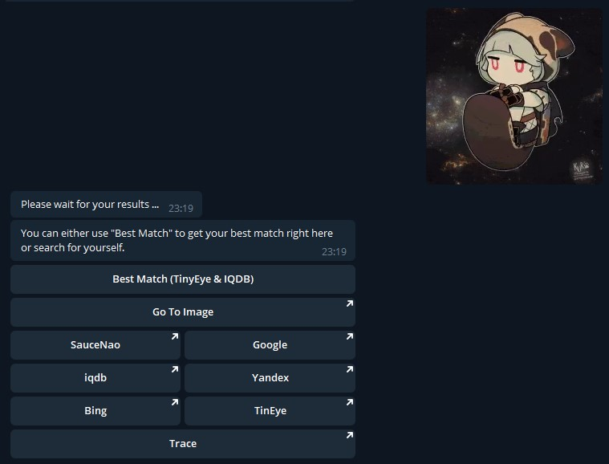

# Reverse Image Search Bot

## ATTENTION

If you just want to use the reverse search you can use my other bot [@XenianBot](https://t.me/XenianBot) intead. 
It has more search engines and is up and running.

- [XenianBot on Telegram](https://t.me/XenianBot) 
- [XenianBot on GitHub](https://github.com/Nachtalb/XenianBot)

This repository here is just for archival purposes. I probably won't work on this anymore. Any new features would
go to XenianBot. 

---

[@reverse_image_search_bot](https://t.me/reverse_image_search_bot)

<!-- toc -->

- [How to use me](#how-to-use-me)
- [Features:](#features)
- [Commands:](#commands)
- [Attention whore stuff:](#attention-whore-stuff)
- [Contributions:](#contributions)
  * [Bug report / Feature request](#bug-report--feature-request)
  * [Code Contribution / Pull Requests](#code-contribution--pull-requests)
  * [Local installation](#local-installation)

<!-- tocstop -->

## How to use me
Send me images or stickers and I will send you direct reverse image search links for IQDB, Google, TinEye, Yandex and 
Bing. For anime images I recommend IQDB and TinEye, for other images I recommend to use Google Yandex, or TinEye.

Attention: The best match feature sometimes does not find a best match on TinEye, even though you do when you open the 
link. Why is this? This is because TinEye I reached the limit of TinEye's free service. TinEye provides 50 searches per 
day to a max of 150 searches per week. And I will not pay for the TinEye atm because it is way too expensive for me.



## Features:
- Give you image reverse search links
- Supports IQDB, Google, TinEye, Yandex and Bing
- Supports normal images like JPG, PNG, WEBP
- Supports stickers
- Supports GIFs (can take some time till the GIFs are ready)
- Supports Videos (will be searched as GIFs)
- Best Match information by TinEye
- Best Match information by IQDB as fallback

## Commands:
- /help, /start: show a help message with information about the bot and it's usage.
- /best_match URL: Search for the best match on TinEye (and IQDB when nothing is found on TinEye). The `URL` is a link 
    to an image

## Attention whore stuff: 
Please share this bot with your friends so that I ([the magician](https://github.com/Nachtalb/) behind this project) 
have enough motivation to continue and maintain this bot.

Check out my other project\[s\]: 
- [@insta_looter_bot](https://github.com/Nachtalb/insta_looter_bot) - Download images and videos from Instagram via 
Telegram


## Contributions:
### Bug report / Feature request
If you have found a bug or want a new feature, please make an issue here: [Nachtalb/animu_image_search_bot](https://github.com/Nachtalb/animu_image_search_bot)

### Code Contribution / Pull Requests
Please use a line length of 120 characters and [Google Style Python Docstrings](http://sphinxcontrib-napoleon.readthedocs.io/en/latest/example_google.html). 

### Local installation
Instead of the old `pip` with `requirements.txt` I use the new and fancy `pipenv` with `pipfile`. If you read the intro
to [pipenv](https://github.com/pypa/pipfile) and [pipfile](https://docs.pipenv.org) you will understand why I use it.

With this info we now install our virtualenv with: 
```bash
pip install pipenv  # Install pipenv
pipenv --three      # Create virtualeenv from your python3 installation
pipenv install      # Install all requirements
pipenv shell        # Spawn shell for your pipenv virtualenv
``` 

After this is complete, you have to get an API Token from Telegram. You can easily get one via the
[@BotFather](https://t.me/BotFather).

Now that you have your API Token copy the `settings.example.py` to `settings.py` and paste in your API Token.
Finally you can use this to start your bot.
```bash
python run_bot.py
``` 

In the `settings.py` you can additionally add a [botan.io](http://botan.io) API Token which let's you create 
statistics.

Thank you for using [@reverse_image_search_bot](https://t.me/reverse_image_search_bot).
